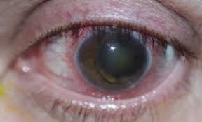
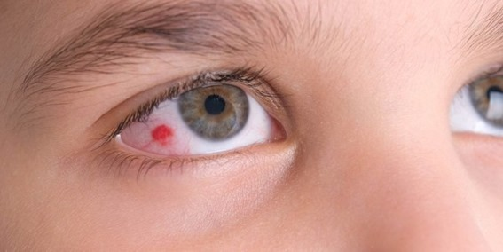
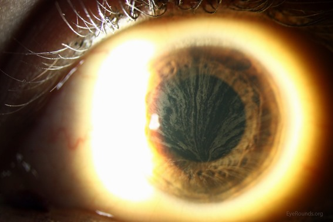

# Erros Inatos do Metabolismo EIM

## O que são?

Você já ouviu falar em erros inatos do metabolismo (EIM)? Consegue pensar em um exemplo? EIM são doenças genéticas raras causadas pela deficiência em uma proteína. Isso afeta diretamente o metabolismo pois muitas dessas proteínas são enzimas ou transportadores que participam de processos como: síntese, degradação, transporte ou armazenamento de moléculas do organismo. Essa deficiência pode afetar a proteína de forma qualitativa ou quantitativa, como mudar o formato da proteína ou sua quantidade. Como as proteínas não desempenham seu papel corretamente, ocorre o acúmulo de substâncias, isso pode ser tóxico aos tecidos e aos líquidos biológicos.

Os EIM representam cerca de 10% de todas as doenças genéticas. Até hoje, muitos profissionais consideram esses casos como extremamente raros de encontrar ‘na vida real’, sendo muitas vezes esquecidos, descartados ou desconsiderados como a opção de diagnóstico. Outro ponto que reforça a dificuldade de diagnóstico são os sintomas comuns a diversas outras doenças, sendo confundido inclusive com outras doenças hereditárias raras, um exemplo é a síndrome Marfan. Ainda não consegue pensar em um exemplo? Vou ilustrar alguns.

- **Albinismo** envolve mutações genéticas que afetam a produção de melanina na pele, cabelos e olhos. Essas mutações podem ocorrer em genes como o TYR, que codifica a enzima tirosinase, essencial para a síntese de melanina. Quando essa enzima está ausente ou não funcional, ocorre a redução ou a ausência de pigmentação nos tecidos.

- **Galactosemia** é um erro que ocorre no metabolismo de carboidratos. Esse distúrbio ocorre por causa da deficiência autossômica recessiva da galactose-1-fosfato uridiltransferase (GALT). Isso significa que o organismo é incapaz de metabolizar a galactose, um dos componentes da lactose (açúcar do leite). Crianças afetadas são geralmente normais ao nascimento, mas desenvolvem problemas gastrointestinais, cirrose hepática e catarata nas semanas seguintes à ingestão de leite.

- **Fenilcetonúria ou PKU** é um EIM resultante de mutações no gene que converte a fenilalanina em tirosina. Uma vez que os pacientes com PKU não podem degradar a fenilalanina, ela se acumula em fluidos corporais e danifica o sistema nervoso central em desenvolvimento na primeira infância.

Os EIM são geralmente multissistêmicos, ou seja, afetam vários tecidos diferentes do corpo pois tratam de substâncias essenciais para o metabolismo de diversas células. Muitos evoluem para o comprometimento neurológico e óbito precoce, muitos morrem antes da adolescência. O diagnóstico dos EIM é complexo, necessitando várias etapas de investigação.

## Quais são os grupos?

Bom, existem mais de 550 doenças descritas, sendo a incidência do seu conjunto estimada em 1: 1000 a 1:2500 nascimentos. No Brasil estima-se 3000 novos casos de EIM a cada ano. Com tantas doenças, foi necessário a criação de grupos para classificar e ajudar na identificação mais eficiente desses erros.

### CLASSIFICAÇÃO CLÍNICA DOS EIM SUS 2014

**A. Grupo I:** relacionado diretamente com ingestão alimentar de proteína ou açúcar, incluindo defeito no metabolismo dos aminoácidos, dos ácidos orgânicos, do ciclo da ureia e intolerância aos açúcares. Esse grupo tem como característica o comprometimento do metabolismo intermediário (que inclui vias metabólicas essenciais para a produção de energia e síntese de biomoléculas), isso gera um quadro clínico de intoxicação aguda e crônica. Ex: Doenças mitocondriais (como Síndrome de Leigh e MELAS), Deficiência de Piruvato Desidrogenase, Deficiência de Carnitina, Doença de Pompe.

**B. Grupo II:** deficiência na produção ou utilização de energia, incluindo doenças de depósito do glicogênio, doenças mitocondriais de cadeia respiratória, defeitos de beta-oxidação de ácidos graxos e hiperlacticemias congênitas; Ex: Fenilcetonúria (PKU), Homocistinúria, Doença da Urina do Xarope de Bordo (MSUD), Hiperamonemia (causada por deficiências no ciclo da ureia), Galactosemia.

**C. Grupo III:** deficiência na síntese ou catabolismo de moléculas complexas, incluindo doenças de depósito lisossômico e dos peroxissomos, dos lipídeos, dos ácidos biliares, das vitaminas, do transporte de metais entre outras. Esse grupo é caracterizado por sinais e sintomas permanentes e progressivos sem relação com ingestão alimentar. Ex: doenças lisossomiais, (como as mucopolissacaridoses e as esfingolipidoses) e as doenças peroxissomiais.

### Classificação Husny e Fernandes-Caldato

Outra classificação possível para os EIM leva em consideração como esses erros afetam o organismo. Nessa classificação eles dividem-se em duas categorias:

**Categoria 1:** engloba as alterações que afetam um único sistema ou apenas um órgão, como o sistema imunológico e os fatores de coagulação (como a doença de Gaucher e Doença do Fabry; já a

**Categoria 2:** abrange aquelas que comprometem uma via metabólica comum a diversos órgãos, como as doenças lisossomais, ou restrito a um órgão apenas, porém com manifestações humorais e sistêmicas, como a hiperamonemia nos defeitos do ciclo da ureia (como a PKU).

Como as doenças da Categoria 2 apresentam uma enorme diversidade de sintomas e aparições clínicas, apresentam uma dificuldade diagnóstica ainda maior que a categoria 1, pois nesta, os sintomas são uniformes e, portanto, o diagnóstico é facilitado.

Respeitando a grande variabilidade de alterações da Categoria 2, essas são divididas em três diferentes grupos conforme suas características fisiopatológicas e fenótipo clínico. Essa segunda diferenciação já se apresenta mais parecida com a que o SUS nos deu:

**A. Grupo I:** Distúrbios de síntese ou catabolismo de moléculas complexas; (grupo 3 no SUS)

**B. Grupo II:** Erros inatos do metabolismo intermediário. Normalmente esse grupo apresenta intoxicação aguda ou crônica; (grupo 1 no SUS)

**C. Grupo III:** Deficiência na produção ou utilização de energia. (grupo 2 no SUS)

## Diagnóstico

O diagnóstico de alguns EIM pode ser feito por testes no período neonatal. No Brasil, o teste do pezinho faz parte do Programa Nacional de Triagem Neonatal, que foi estabelecido em 2001 (Portaria GM/MS nº 822/2001) e incluía 6 doenças (fenilcetonúria, deficiência de biotinidase, fibrose cística, hemoglobinopatias, hiperplasia adrenal congênita e hipotireoidismo congênito). Em 2021, o teste do pezinho, ofertado gratuitamente pelo SUS, foi ampliado (Lei nº 14.154), passando a incluir mais de 50 doenças (Ministério da Saúde, 2021).

Mas eu disse lá em cima que existem vários processos de investigação para chegar no diagnóstico de uma EIM. Quais são eles? Abaixo tem um fluxograma que resume o protocolo de diagnóstico dos EIM ofertado pelo SUS.

## Fluxograma de Diagnóstico dos EIM

Bom, vamos destrinchar como esse fluxograma funciona.

### PROCEDIMENTOS DA ATENÇÃO BÁSICA:

Primeiro de tudo é necessário haver uma consulta médica. “Anamnese” corresponde ao processo de coleta de informações sobre a história médica de um paciente. Isso inclui sintomas atuais e anteriores, condições médicas prévias, tratamentos realizados, medicamentos em uso, histórico familiar de doenças, entre outros aspectos relevantes para o diagnóstico e o tratamento médico. No caso dos EIM, se dá atenção em especial para:

- antecedentes gestacionais e de parto,
- história alimentar,
- desenvolvimento neuropsicomotor (atraso, involução),
- consanguinidade,
- histórico familiar positivo para casos semelhantes,
- óbitos neonatais ou na infância de causa indeterminada,
- exame físico completo com especial atenção para antropometria (que seriam medições como: altura, peso, circunferência corporal, espessura da pele e gordura),
- características físicas específicas (características faciais, dos membros, proporções corporais e anomalias),
- exame neurológico, alterações oculares, de pele, cabelos e unhas (fâneros, ou seja, características visíveis do corpo humano).

Com uma suspeita clínica baseada na característica específica da anamnese do paciente, ocorre o encaminhamento para o Serviço Especializado / Serviço de Referência em Doenças Raras. Lá será reavaliado a presença de um ou mais dos itens abaixo:

- **História Familiar:**
  - pais consanguíneos,
  - abortos espontâneos ou neomortos,
  - hidropisia fetal não imune inexplicada, (há acúmulo anormal de líquido nos tecidos do feto, levando a um aumento do volume do líquido amniótico durante a gestação.)
  - óbitos precoces na infância (ou seja, mortes de crianças em uma idade muito jovem, geralmente antes dos 5 anos, que podem estar associadas a condições genéticas ou problemas de saúde graves.)
  - doença neurológica progressiva, retardo mental, deficiência visual e/ou auditiva,
  - acidose metabólica (um desequilíbrio ácido-base no corpo, onde há um excesso de ácidos ou uma perda significativa de bicarbonato, levando a um pH sanguíneo anormalmente baixo.)
  - hepatomegalia/esplenomegalia (aumento do fígado e/ou baço.)
  - atraso de crescimento, baixa estatura,
  - osteopenia inexplicada (é uma condição em que os ossos têm uma densidade mineral óssea mais baixa do que o normal. Isso significa que os ossos são mais fracos do que os ossos saudáveis, mas não são tão fracos quanto na osteoporose.)

- **História Pessoal:**
  - má adaptação neonatal,
  - acidose metabólica, hipoglicemia,
  - vômitos recorrentes, diarreia,
  - hepatomegalia,
  - sinais neurológicos: alteração de tônus, atraso motor, convulsão,
  - atraso de crescimento, baixa estatura,
  - osteopenia inexplicada,
  - herança mitocondrial (herança genética transmitida pelo DNA mitocondrial, que é exclusivamente herdado da mãe. As mitocôndrias são organelas celulares responsáveis pela produção de energia e contêm seu próprio material genético. As doenças mitocondriais são causadas por mutações no DNA mitocondrial e podem afetar a função energética das células.),
  - herança autossômica recessiva (um padrão de herança genética onde duas cópias de um gene alterado, uma herdada de cada pai, são necessárias para que uma pessoa desenvolva uma condição ou doença. Se ambos os pais são portadores de uma mutação genética recessiva, há uma chance de 25% de que a criança herde ambas as cópias alteradas e manifeste a condição.),
  - herança autossômica dominante (um padrão de herança genética em que apenas uma cópia alterada de um gene é suficiente para causar uma doença. Isso significa que se um dos pais carrega o gene dominante para uma condição específica, há uma chance de 50% de que a criança herde essa condição. Doenças com esse padrão de herança podem se manifestar em cada geração de uma família.),
  - herança multifatorial (um padrão de herança genética onde múltiplos fatores, incluindo variações em vários genes e influências ambientais, contribuem para o desenvolvimento de uma característica ou doença. Em doenças multifatoriais, a combinação desses fatores pode determinar o risco e a gravidade da condição.),
  - herança ligada ao X (um padrão de herança genética em que um gene alterado está localizado no cromossomo X. Como homens têm um cromossomo X e um Y, e mulheres têm dois cromossomos X, doenças ligadas ao X podem se manifestar de maneira diferente entre os sexos. Em geral, os homens são mais frequentemente afetados por doenças recessivas ligadas ao X, porque eles não têm uma segunda cópia do cromossomo X para compensar a mutação.),
  - herança ligada ao Y (um padrão de herança genética em que um gene alterado está localizado no cromossomo Y, que é um dos cromossomos sexuais nos seres humanos e está presente apenas nos homens. Como o cromossomo Y é passado de pai para filho, as características ou doenças ligadas ao Y são herdadas exclusivamente pela linha paterna.),
  - herança mitocondrial (os genes mitocondriais são herdados exclusivamente da mãe, já que o óvulo contribui com a maioria das mitocôndrias para o embrião. Portanto, mutações no DNA mitocondrial são passadas de mãe para filhos de ambos os sexos. Doenças mitocondriais podem afetar a produção de energia celular e levar a uma variedade de sintomas, dependendo de quais tecidos são mais afetados pela disfunção mitocondrial.),
  - erros inatos do metabolismo (um grupo de doenças genéticas que afetam o metabolismo de substâncias específicas no organismo. Estas doenças são causadas por mutações em genes que codificam enzimas ou proteínas responsáveis por reações químicas essenciais ao metabolismo. Dependendo da substância afetada, os sintomas e a gravidade dos erros inatos do metabolismo podem variar amplamente.),
  - herança multifatorial (essa herança é determinada por uma combinação de fatores genéticos e ambientais. Diferente da herança simples, onde uma mutação genética única pode causar uma doença, a herança multifatorial envolve a interação de múltiplos genes, cada um contribuindo com um pequeno efeito para o desenvolvimento de uma condição. Fatores ambientais, como dieta, estilo de vida e exposição a substâncias tóxicas, também podem influenciar a expressão dessas características ou doenças.),
  - herança autossômica recessiva (em condições autossômicas recessivas, ambos os pais portadores têm uma cópia normal e uma cópia mutada do gene em questão. A condição só se manifesta se o indivíduo herdar duas cópias mutadas do gene, uma de cada pai. Se uma pessoa tem apenas uma cópia mutada, ela é considerada portadora e geralmente não apresenta sintomas. As doenças autossômicas recessivas podem pular gerações, aparecendo apenas quando dois portadores têm filhos juntos.),
  - herança autossômica dominante (as doenças autossômicas dominantes são causadas por mutações em genes localizados em um dos cromossomos não sexuais (autossomos). Uma única cópia de uma mutação dominante é suficiente para causar a doença, o que significa que se um dos pais tem uma mutação dominante, há uma probabilidade de 50% de que cada filho herde a mutação e a condição associada. Essas condições tendem a aparecer em todas as gerações de uma família, a menos que haja uma nova mutação ou uma redução na penetrância da mutação.),
  - herança ligada ao sexo (doenças genéticas que são transmitidas por genes localizados nos cromossomos sexuais (X ou Y). Como os homens têm um cromossomo X e um Y, e as mulheres têm dois X, a forma como essas doenças se manifestam pode variar entre os sexos.)

- **História Gestacional:**
  - morte fetal inexplicada,
  - má formação congênita inexplicada,
  - atraso de crescimento intrauterino,
  - polidrâmnio (excesso de líquido amniótico no útero durante a gravidez.)
  - pré-eclâmpsia (é uma complicação séria que ocorre durante a gravidez e é caracterizada por hipertensão arterial e sinais de danos a órgãos, geralmente os rins ou fígado.)

- **Sinais e Sintomas no Período Neonatal:**
  - recém-nascido prematuro, pequeno para a idade gestacional ou pós-maturo,
  - alteração em triagem neonatal (teste do pezinho),
  - hipoglicemia persistente ou de difícil controle,
  - vômitos recorrentes, desidratação,
  - sinais neurológicos (letargia, convulsão, coma, encefalopatia),
  - hipoglicemia,
  - acidose metabólica,
  - hiperamonemia,
  - cetonúria,
  - atraso no desenvolvimento ou regressão,
  - episódios recorrentes de doença aguda,
  - fenótipo anormal com ou sem dismorfismos,
  - sinais e sintomas progressivos.

Lembrando que é fundamental a realização de exame clínico e neurológico detalhados em natimortos e em indivíduos que tenham falecido com quadro de distúrbios metabólicos / morte súbita de causa indeterminada.

### ATENÇÃO ESPECIALIZADA:

Depois de passado pelo Serviço Especializado / Serviço de Referência em Doenças Raras, o paciente será levado a atenção especializada que incluirá:

- Anamnese e exame físico completos, investigação familiar (elaboração de heredograma, que é uma representação gráfica de uma árvore genealógica que mostra as relações de parentesco e a presença ou ausência de uma determinada característica ou doença em uma família), histórico de consanguinidade e morte fetal, natimortos ou história familiar de abortamentos de repetição e/ou óbitos precoces.
- Solicitação e interpretação de exames laboratoriais especializados.
- Investigação detalhada dos sinais e sintomas presentes, destacando-se a investigação genético-clínica de natimortos e de indivíduos falecidos com distúrbios metabólicos / morte súbita de causa indeterminada.
- Encaminhamento para outras especialidades e aconselhamento genético conforme necessidade.
- Contrarreferência para seguimento na Atenção Básica.
