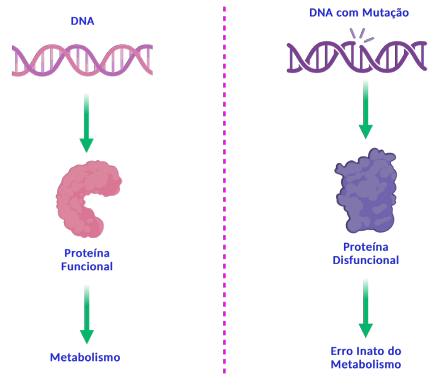
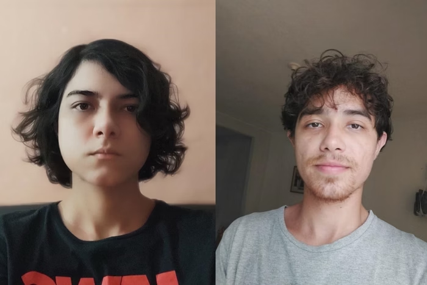
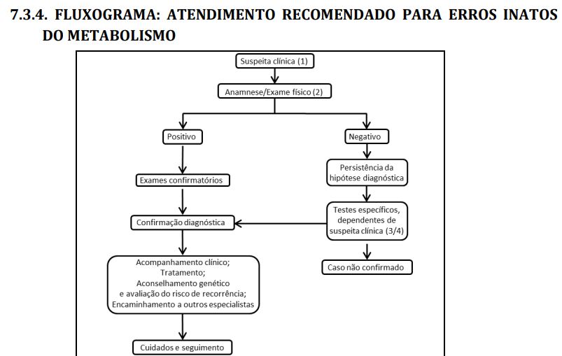
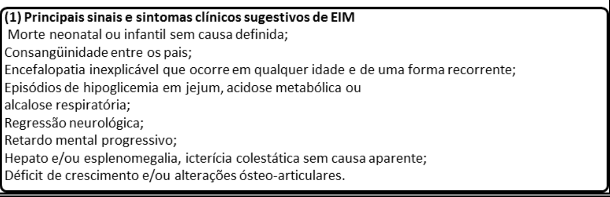
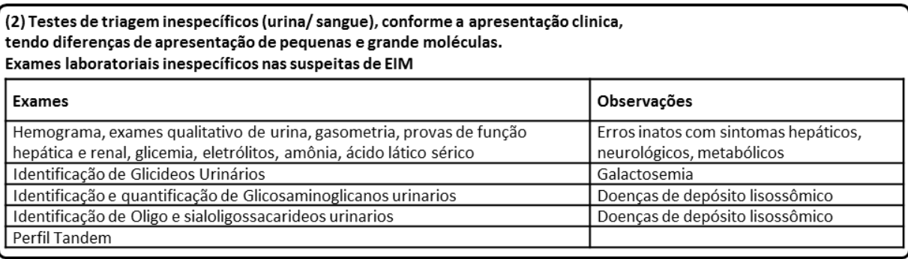
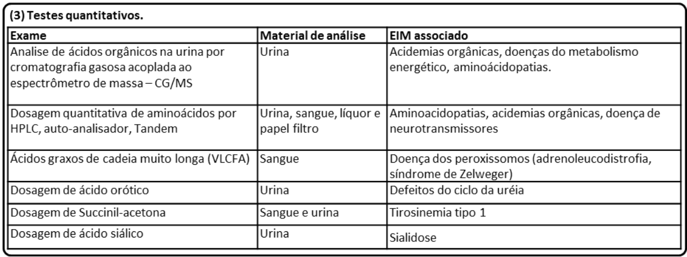
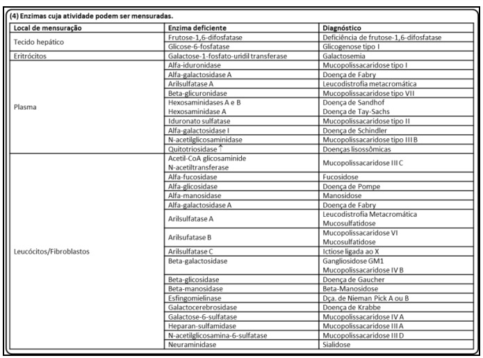
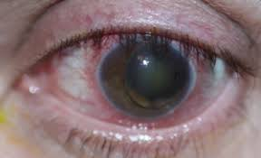
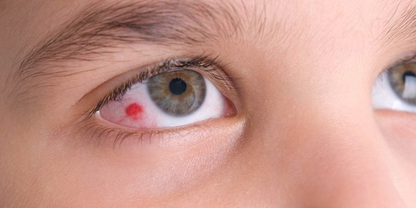
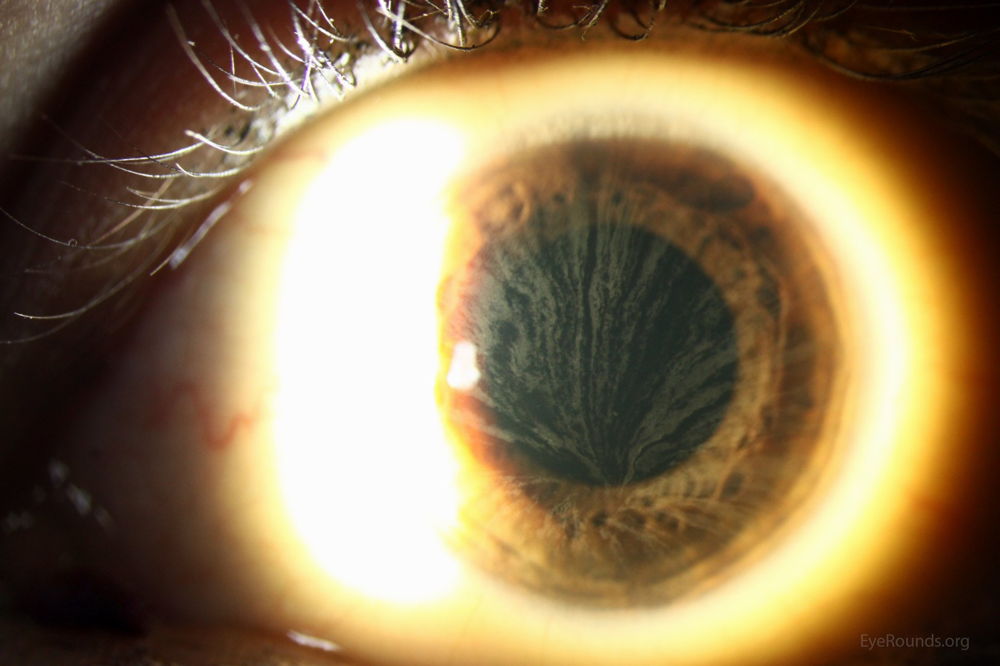

# Erros Inatos do Metabolismo EIM

## O que são?

Você já ouviu falar em erros inatos do metabolismo (EIM)? Consegue pensar em um exemplo?  

EIM são doenças genéticas raras causadas pela deficiência em uma proteína. Isso afeta diretamente o metabolismo pois muitas dessas proteínas são enzimas ou transportadores que participam de processos como: síntese, degradação, transporte ou armazenamento de moléculas do organismo. Essa deficiência pode afetar a proteína de forma qualitativa ou quantitativa, como mudar o formato da proteína ou sua quantidade. Como as proteínas não desempenham seu papel corretamente, ocorre o acumulo de substâncias, isso pode ser toxico aos tecidos e aos líquidos biológicos. 

{: .center-image}

Os EIM representam cerca de 10% de todas as doenças genéticas.  

Até hoje, muitos profissionais consideram esses casos como extremamente raros de encontrar ‘na vida real’, sendo muitas vezes esquecidos, descartados ou desconsiderados como a opção de diagnóstico. Outro ponto que reforça a dificuldade de diagnostico são os sintomas comuns a diversas outras doenças, sendo confundido inclusive com outras doenças hereditárias raras, um exemplo é a síndrome Marfam.  

Ainda não consegue pensar em um exemplo?  Vou ilustrar alguns.  

O Albinismo envolve mutações genéticas que afetam a produção de melanina na pele, cabelos e olhos. Essas mutações podem ocorrer em genes como o TYR, que codifica a enzima tirosinase, essencial para a síntese de melanina. Quando essa enzima está ausente ou não funcional, ocorre a redução ou a ausência de pigmentação nos tecidos.

{: .center-image}

Galactosemia é um erro que ocorre no metabolismo de carboidratos. Esse distúrbio ocorre por causa da deficiência autossômica recessiva da galactose-1-fosfato uridiltransferase (GALT). Isso significa que o organismo é incapaz de metabolizar a galactose, um dos componentes da lactose (açúcar do leite). Crianças afetadas são geralmente normais ao nascimento, mas desenvolvem problemas gastrointestinais, cirrose hepática e catarata nas semanas seguintes à ingestão de leite. 

Fenilcetonúria ou PKU é um EIM resultante de mutações no gene que converte a fenilalanina em tirosina. Uma vez que os pacientes com PKU não podem degradar a fenilalanina, ela se acumula em fluidos corporais e danifica o sistema nervoso central em desenvolvimento na primeira infância. 

Apesar de apresentarem sintomas desde a infância, não são todos os EIM que apresentarão sintomas físicos característicos. Como no caso da galactosemia e da PKU, que não apresentam sintomas físicos tão característicos.  

{: .center-image}

imagem retirada de uma matéria do metrópoles que mostra esses dois pacientes de PKU.  

Os EIM são geralmente multissistêmicos, ou seja, afetam vários tecidos diferentes do corpo pois tratam de substancia essenciais para o metabolismo de diversas células.  Muitos evoluem para o comprometimento neurológico e óbito precoce, muitos morrem antes da adolescência. O diagnóstico dos EIM é complexo, necessitando várias etapas de investigação.  

## QUAIS SÃO OS GRUPOS?

Bom, existem mais de 550 doenças descritas, sendo a incidência do seu conjunto estimada em 1: 1000 a 1:2500 nascimentos. No Brasil estima-se 3000 novos casos de EIM a cada ano. Com tantas doenças, foi necessário a criação de grupos para classificar e ajudar na identificação mais eficiente desses erros. 
 

### CLASSIFICAÇÃO CLÍNICA DOS EIM SUS 2014

- Grupo I: relacionado diretamente com ingestão alimentar de proteína ou açúcar, incluindo defeito no metabolismo dos aminoácidos, dos ácidos orgânicos, do ciclo da uréia e intolerância aos açúcares. 
Esse grupo tem como característica o comprometimento do metabolismo intermediário (que inclui vias metabólicas essenciais para a produção de energia e síntese de biomoléculas), isso gera um quadro clínico de intoxicação aguda e crônica,  
Ex: Deficiência de Piruvato Desidrogenase, Deficiência de Carnitina, Doença de Pompe. 

- Grupo II: deficiência na produção ou utilização de energia, incluindo doenças de depósito do glicogênio, doenças mitocondriais de cadeia respiratória, defeitos de beta-oxidação de ácidos graxos e hiperlacticemias congênitas; 
Ex: Fenilcetonúria (PKU), Homocistinúria, Doença da Urina do Xarope de Bordo (MSUD), Hiperamonemia (causada por deficiências no ciclo da ureia), Galactosemia 

- Grupo III: deficiência na síntese ou catabolismo de moléculas complexas, incluindo doenças de depósito lisossômico e dos peroxissomos, dos lipídeos, dos ácidos biliares, das vitaminas, do transporte de metais entre outras. Esse grupo é caracterizado por sinais e sintomas permanentes e progressivos sem relação com ingestão alimentar.  
Ex: doenças lisossomiais, (como as mucopolissacaridoses e as esfingolipidoses) e as doenças peroxissomiais 

## CLASSIFICAÇÃO HUSNY E FERNANDES-CALDATO 

Outra classificação possível para os EIM leva em consideração como esses erros afetam o organismo. Nessa classificação eles dividem-se em duas categorias: a Categoria 1, engloba as alterações que afetam um único sistema ou apenas um órgão, como o sistema imunológico e os fatores de coagulação (como a doença de Gaucher e Doença do Fabry); já a Categoria 2, abrange aquelas que comprometem uma via metabólica comum a diversos órgãos, como as doenças lisossomais, ou restrito a um órgão apenas, porém com manifestações humorais e sistêmicas, como a hiperamonemia nos defeitos do ciclo da uréia (como a PKU). 
 

Como as doenças da Categoria 2 apresentam uma enorme diversidade de sintomas e aparições clinicas, apresentam uma dificuldade diagnóstica ainda maior que a categoria 1, pois nesta, os sintomas são uniformes e, portanto, o diagnóstico é facilitado. Respeitando a grande variabilidade de alterações da Categoria 2, essas são divididas em três diferentes grupos conforme suas características fisiopatológicas e fenótipo clínico. Essa segunda diferenciação já se apresenta mais parecida com a que o SUS nos deu:  

- Grupo I: Distúrbios de síntese ou catabolismo de moléculas complexas; (compreende o grupo 3 no SUS) 
- Grupo II: Erros inatos do metabolismo intermediário. Normalmente esse grupo apresenta intoxicação aguda ou crônica; (compreende o grupo 1 no SUS) 
- Grupo III: Deficiência na produção ou utilização de energia. (compreende o grupo 2 no SUS) 

## DIAGNOSTICO

O diagnóstico de alguns EIM pode ser feito por testes no período neonatal. No Brasil, o teste do pezinho faz parte do Programa Nacional de Triagem Neonatal, que foi estabelecido em 2001 (Portaria GM/MS nº 822/2001) e incluía 6 doenças (fenilcetonúria, deficiência de biotinidase, fibrose cística, hemoglobinopatias, hiperplasia adrenal congênita e hipotireoidismo congênito). Em 2021, o teste do pezinho, ofertado gratuitamente pelo SUS, foi ampliado (Lei nº 14.154), passando a incluir mais de 50 doenças (Ministério da Saúde, 2021).  

Mas eu disse lá em cima que existem vários processos de investigação para chegar no diagnostico de uma EIM. Quais são eles?   

Abaixo tem um fluxograma que resume o protocolo de diagnóstico dos EIM ofertado pelo SUS.

{: .center-image}
{: .center-image}
{: .center-image}
{: .center-image}
{: .center-image}

#### Bom, vamos destrinchar como esse fluxograma funciona.  

## PROCEDIMENTOS DA ATENÇÃO BÁSICA:  

Primeiro de tudo é necessário haver uma consulta medica. “Anamnese” corresponde ao processo de coleta de informações sobre a história médica de um paciente. Isso inclui sintomas atuais e anteriores, condições médicas prévias, tratamentos realizados, medicamentos em uso, histórico familiar de doenças, entre outros aspectos relevantes para o diagnóstico e o tratamento médico. No caso dos EIM, se dá atenção em especial para: 

- antecedentes gestacionais e de parto,  
- história alimentar,  
- desenvolvimento neuropsicomotor (atraso, involução),  
- consanguinidade,  
- histórico familiar positivo para casos semelhantes,  
- óbitos neonatais ou na infância de causa indeterminada,  
- exame físico completo com especial atenção para antropometria,  
- características físicas especificas,   
- exame neurológico, alterações oculares, de pele, cabelos e unhas (fâneros, ou seja, características visíveis do corpo humano). 

Com uma suspeita clinica baseada na característica especifica do anamnese do paciente, ocorre o encaminhamento para o Serviço Especializado / Serviço de Referência em Doenças Raras. Lá será re-avaliado a presença de um ou mais dos itens abaixo:  

###  História Familiar:  

- pais consanguíneos,  

- abortos espontâneos ou neomortos,  

-  hidropisia fetal não imune inexplicada,

- óbitos neonatais,  

- familiares afetados por algum EIM,  

-  fenilcetonúria materna,

-  irmãos com doenças inexplicadas (encefalopatia, sepsis, síndrome da morte súbita do lactente).
### História gestacional:  

-  síndrome HELLP,   

-  esteatose hepática aguda da gravidez. 

### Sinais e sintomas no período neonatal:  

- Hipoglicemia injustificada,

- alcalose respiratória em intercorrências perinatais, 

- acidose metabólica persistente,

-  cetonúria, síndrome séptica sem fator de risco para infecção, 

- cardiomiopatia hipertrófica,  

- disfunção hepática injustificada, 

- odores incomuns

- manifestações neurológicas precoces não justificadas por intercorrências na gravidez, 

- parto e período neonatal,  

-  discrasias sanguíneas inexplicadas, 

- instabilidade térmica,  

- catarata congênita,  

- dificuldades alimentares.  

### Sinais e sintomas fora do período neonatal:

- Distúrbios metabólicos inexplicáveis,  

- quadros recorrentes de vômitos e/ou desidratação que representam crise metabólica,  

- epilepsia inexplicável e/ou de difícil controle,  

- quadros neurológicos recorrentes como ataxia intermitente  ou crises de letargia e/ou coma.  

- quadro neurológico flutuante que alterna lucidez com torpor ,  

- atraso de desenvolvimento neuropsicomotor ou Deficiência Intelectual inexplicável,  

- involução do desenvolvimento neuropsicomotor ou perda da fala e/ou marcha e/ou compreensão em qualquer idade,  

- hepatomegalia  e/ou esplenomegalia inexplicável acompanhada ou não de atraso do desenvolvimento ou Deficiência Intelectual,  

- anormalidades oculares como, luxação do cristalino ou mancha vermelho cereja  ou  retinose pigmentar  ou córnea verticillata  ou cegueira familiar,  

-  quadro semelhante a acidente vascular encefálico inexplicável em qualquer idade.

{: .center-image}
{: .center-image}
{: .center-image}

#### Esses e outros sinais/sintomas são possíveis de ocorrer tanto no período neonatal, quanto durante o crescimento das crianças.

Após essa primeira investigação detalhada, encaminhamos o paciente para a atenção especializada, que será a responsável pelo diagnostico, habilitação/reabilitação e tratamento do paciente. Na atenção especializada temos alguns procedimentos para ajudar durante todo processo tais como:  

- a) Anamnese e elaboração de heredograma de pelo menos três gerações, 

- b) atenção aos antecedentes gestacionais, condições ao nascimento e período neonatal,  

- c) acompanhamento do desenvolvimento somático e neuropsicomotor e outras intercorrências mórbidas relevantes.  

- d) Exame físico completo, com especial atenção a antropometria, presença de sinais dismórficos, exame neurológico, alterações oculares e dos cabelos. 

- e) Avaliação genético-clínica de natimortos e de indivíduos falecidos com distúrbios metabólicos / morte súbita de causa indeterminada; 

- f) Encaminhamento para outras especialidades, para investigação e manejo, se necessário; 

- g) Aconselhamento Genético (AG); 

- h) Contrarreferência para seguimento na Atenção Básica, com diagnóstico (quando possível), orientação e monitoramento de cuidados, e conclusão do AG; 

### APOIO DIAGNÓSTICO: EXAMES COMPLEMENTARES: 

Classificação do paciente em um dos três grupos citados acima (Classificação Clínica dos EIM – Grupos I, II e III) e realização de triagem urinária específica para detecção de metabólitos relacionados aos EIM e triagem sanguínea. É importante salientar que sempre que considerado um EIM deve ser considerada a realização de triagem no sangue e na urina, principalmente para a Classificação Clínica dos EIM dos grupos I e III 

- a) Triagem sanguínea solicitada na suspeita de um EIM (indicação seletiva): Hemograma; Gasometria venosa; Sódio, potássio, cloro; Glicose; Colesterol total e frações, triglicérides; ALT, AST, gama GT; Ácido úrico; CPK; Lactato, piruvato, amônia; 

- b) Exames complementares e consultas solicitadas: Exames de Imagem; Avaliação hormonal; Avaliação oftalmológica; Avaliação auditiva; Avaliação neurológica. Amostras de sangue/urina do paciente deverão ser encaminhadas para laboratórios de referência em EIM, juntamente com a descrição do caso e os resultados dos exames acima citados. As amostras encaminhadas para estes laboratórios deverão ser analisadas conforme a suspeita diagnóstica: 

- a) Dosagem quantitativa de aminoácidos no sangue, e/ou na urina 

- b) Dosagem de ácidos orgânicos na urina; 

- c) Cromatografia ou eletroforese ou dosagem de glicosaminoglicanos na urina; 

- d) Cromatografia / dosagem de sialiloligossacarideos; 

- e) Cromatografia / dosagem de oligossacarídeos; 

- f) Cromatografia de açúcares. 

#### Realizar, conforme o caso: 

- a) Ensaios enzimáticos específicos em plasma e ou sangue em papel filtro; 

- b) Ensaios de enzimas específicas em leucócitos, eritrócitos e outros tecidos; 

- c) Ensaios de enzimas específicas e outros testes em células cultivadas; 

- d) Exames de genética molecular (indicação seletiva). 

- e) Outras tecnologias de análise bioquímicas ou moleculares incorporadas. 

Com o apoio dessas informações é possível indicar o diagnóstico especifico para o paciente. Com um diagnóstico é possível iniciar o tratamento.  

## Tratamentos

O reconhecimento precoce dos EIM é de extrema importância para uma possibilidade de tratamento, pois a maioria desses casos, se iniciado o tratamento precocemente, pode até reverter o quadro clínico e promover um desenvolvimento adequado, podendo haver sequelas mínimas ou inexistentes. Há possibilidade de intervenção terapêutica em boa parte dos casos, pelo menos para a redução dos sintomas clínicos. O principal objetivo terapêutico é restabelecer o equilíbrio metabólico e, para isso, podem ser utilizadas diversas estratégias, isoladas ou em combinação. O tratamento específico envolve dietoterapia, uso de fármacos, reposição enzimática e até transplante de órgãos e tecidos. Pacientes com EIM necessitam de acompanhamento especializado cuidadoso. 

O estudo da fisiopatologia, que é a investigação de como as doenças afetam o funcionamento normal do corpo, permitiu a criação de protocolos para o controle metabólico de muitos EIM. Os importantes progressos no entendimento das bases bioquímicas e moleculares dos EIM intermediário têm proporcionado um arsenal terapêutico cada vez maior para o manejo de muitas dessas condições. Para isso, os avanços da biotecnologia têm permitido não só interferir na síntese de moléculas como produzir, em laboratório, as próprias enzimas que são administradas ao paciente. Outras biotecnologias continuam em desenvolvimento gerando novas estratégias que envolvem o resgate da atividade enzimática residual, a terapia celular e a terapia gênica, assim como terapias combinadas. 

“Embora para algumas doenças as possibilidades de tratamento sejam ainda restritas, por desconhecimento do defeito básico ou por impossibilidade de intervir no seu curso, esta tem sido a área da genética que mais tem se beneficiado das novas ferramentas biotecnológicas que, ao lado das antigas, mas eficazes dietas especiais e suplementações de co-fatores, permite que muitos EIM sejam hoje condições tratáveis.” (Schwartz et al., 2008, p. 9) 

A seguir, vou falar um pouco sobre alguns princípios gerais empregados no tratamento de EIM e o manejo específico para algumas doenças metabólicas.

- 1) Restrição do acúmulo do substrato através da dieta 

Essa forma de tratamento se baseia em nos níveis dos produtos tóxicos que podem ser restritos e controlados com uma dieta específica. Contudo, nem todas as patologias podem ser controladas dessa maneira, como alguns defeitos do ciclo da uréia, apesar da restrição de proteínas promoverem uma diminuição do acúmulo de metabólitos tóxicos, os resultados tanto no quadro bioquímico quanto no clínico nem sempre são favoráveis. Pois, mesmo após a introdução da dieta, há acúmulo de substratos que continuam sendo formados. Além disso, deve-se ter em conta que o tratamento deve ser continuado por toda a vida, mesmo após estabilização do quadro. 
 

- 2) Remoção do acúmulo de substrato por inibição 

Uma das estratégias abordadas pela biotecnologia é de controlar a ação das enzimas. Na tirosinemia hereditária ou tipo 1, além do tratamento dietético com restrição de tirosina e fenilalanina, a introdução de uma droga capaz de inibição da enzima HPPD foi revolucionário para o tratamento dessa doença. A redução da produção de fumarilacetoacetato, maleilacetoacetato e succinilacetona é muito importante, pois esses compostos são tóxicos quando acumulados. 

- 3) Rapida remoção de substrato toxico 

Muitas vezes não é possível esperar pela redução dos níveis desses compostos tóxicos a partir dessas outras formas, por isso é necessária a sua remoção forçada para evitar/minimizar os danos neurológicos relacionados. Para fazer isso, dependendo da gravidade do quadro, utiliza-se a diálise, por exemplo, para a remoção da toxina, ou medicações que induzem um desvio da rota metabólica ou provocam a sua rápida excreção urinária. 
 

Por exemplo, o uso do benzoato de sódio, fenilacetato ou fenilbutirato de sódio, utilizados nos defeitos do ciclo da uréia, promove aumento da excreção dos compostos nitrogenados, reduzindo, desta forma, o acúmulo da amônia. 

- 4) Estimulo da atividade enzimática residual 

Para acelerar um processo, algumas enzimas dependem da participação de compostos não protéicos, como vitaminas ou minerais, que agem como co-fatores em muitas rotas metabólicas. Nos pacientes com deficiência de biotinidase, o tratamento com biotina, leva a uma resposta clinica dramática, revertendo o quadro de convulsões, acidose metabólica e manifestações cutâneas. 

Vale ressaltar que o uso a longo prazo das vitaminas deve ser restrito a pacientes com erros metabólicos sabidamente responsivos a tal tratamento.  

- 5) Reposição do produto deficial

Em alguns EIM, a manifestação clinica não está relacionada ao acúmulo do substrato e sim à falta do produto. Nos defeitos do ciclo da uréia, a reposição de arginina ou citrulina pode reverter o quadro de intoxicação por amônia; nas glicogenoses, em que o uso do carboidrato reverte a hipoglicemia, e na deficiência de tetrahidrobiopterina (BH4), em que o uso dos neurotransmissores melhora o desenvolvimento neuropsicomotor e reduz consideravelmente as crises convulsivas e consequente deterioração neurológica.” 

## Bibliografia 

 SCHUCK, Patrícia Fernanda; FERREIRA, Gustavo Costa. Vamos falar sobre erros inatos do metabolismo?. Erros Inatos do Metabolismo, [s. l.], 2019. Disponível em: https://prinex.uff.br/wp-content/uploads/sites/497/2023/12/Vamos-falar-sobre-erros-inatos-do-metabolismo.pdf. Acesso em: 25 jul. 2024.   

http://scielo.iec.gov.br/scielo.php?script=sci_arttext&pid=S0101-59072006000200008&endereco 2 

https://integrada.minhabiblioteca.com.br/reader/books/9788595151819/epubcfi/6/46
[%3Bvnd.vst.idref%3DaB978853528400300012X]!/4/2/6/6/2/10/2/8/3:96[na%20%2Ce%20o] 
Livro Genética Médica – susana 3  

https://bvsms.saude.gov.br/bvs/publicacoes/diretrizes_atencao_integral_pessoa_doencas_raras_SUS.pdf 
Ministério da saude 4 